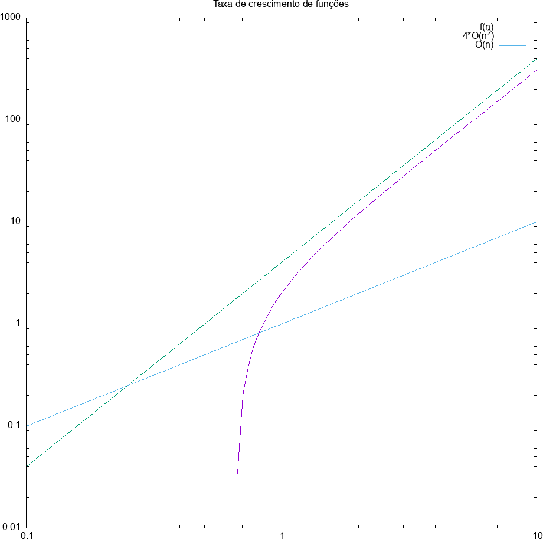

# Ordem de Funções - Análise de Algoritmos
<!-- - Notação O e similares
    - O que é a notação O e porque estudamos ordem de funções?
        - **Notação O**: É uma ferramenta usada para analise de algoritmos. Auxiliando a entender e comparar o tempo de execução (número de passos executados) de algoritmos em relação ao crescimento/tamanho/natureza do problema. É realizado uma abstração em relalção ao tipo de linguagem utilizada, hardware, software disponíveis e assumindo:
            * O tamnho da entrada como sendo n
            * Cada operação leva aproximadamente o mesmo tempo constante (adição, atribuição, chamda de funções, retorno de funções comparações...) 
        - **Ordem de Funções**: Também conhecida como análise assintótica. Nos ajudam a entender e analisar o desempenho dos algoritmos. -->

- Algoritmos
    Segundo Crmen et. al. (2002), um algoritmo é um procedimento computacional bem definido que toma um conjunto de valores como entrada e produz algum conjunto de valores como saída.
    Sendo assim, precisamos entender quais características são importantes em um algoritmo. De forma superficial e abstrata, podemos resumir que as características mais relevantes para um algoritmo são:
    - Perfomace.
    - Simplicidade: Quanto mais simples, mais fácil o entedndimento e menor a chance de erros.
    - Corretude: Segundo Cormen, um algoritmo é correto se, para toda **instância** de entrada **válida**, ele terminar com a saída correta.

    Desejamos que um algotirmo seja correto, no entanto isso não pode ser a qualquer custo, devemos levar em consideração a eficiência do algoritmo.

-------------------

 ### Custo de Utilização de um Algoritmo
    O custo de um algotirmo pode ser medido por:

    - Pelo tempo de execução computacional.
    - Pelo uso de modelos matemáticos que representem o custo do algoritmo. 

- Custo de Algoritmos
O custo computacional de um algoritmos, pode ser avalido por duas pespectivas: tempo de execução e espaço ocupado na memória.
Para a aplicação de análise de algoritmos, analisar o espaço ocupado torna a análise menos genérica (uma lista de caracters requer menos espaço na memória do que um conjunto de imagens). Sendo assim, para melhor compreensão de análise de algoritmos, iremos abstrair alguns conceitos e iremos assumir que a eficiência de um algoritmo está relacionado ao tempo de execução em função do tamanho da entrada a ser processada.

Custo de utilização:
- O tempo de execução de um programa pode ser influenciado por diversos fatores, como: SO, linguagem, compilador, hardware, tipo do dado de entrada...

- **Medidas por modemos matemáticos**
  - Contam-se as operações a serem executadas
  - Associa-se um custo a execução de cada operação
  - Determina-se o custo final como uma função da entrada

Para melhor entedimento das funções de custo, assumiremos:
  - Ignorar o custo de algumas das operações envolvidas.
  -  Considerar apenas as operações mais significativas.
  - Considerar que todas as operações têm o mesmo custo unitário

#### Medição de custo
A partir de agora, introduziremos um termo mais técnico para a função de custo, que é de denominada por **Função de Complexidade** $f(n)$ ou $T(n)$.
- $f(n)$ é a medida de tempo necessária para executar um algoritmo para um problema de tamanho n. Em termos, essa função não exprime o tempo total para executar o algoritmo, mas o número de vezes que uma operação relevante é executada.

Em análise de algoritmos, estamos interessados em otimizar, compreender, categorizar, o pior cenário possível no contexto de funcionamento do algoritmo sob análise. Sendo assim, todas as análises aconteceram sob a espectiva do pior caso possível, já que o melhor e médio caso*, não impactam diretamente na eficiência do algoritmo.


-----------------------
### Análise experimental:

Dado um problema, devemos ser capazes de mapea-lo em uma classe de algoritmos e encontrar qual deles apresentam a melhor eficiência computacional.

Por exemplo, dado um vetor de tamanho n, desejamos encontrar o valor valor:

```
int arrayMax (int input1[], int n)
{
    currentMax = input1[0];
    for (i=1; i<n; i++){
            if (input1[i] > currentMax)
                currentMax = input1[i];
    }

    return currentMax;
}
```
Ao analisarmos o número de operações primitivas realizadas no código, chegamos ao seguinte número de passos: 
Vamos considerar que todas as operações levam o mesmo tempo para serem executadas, assim contando apenas o número de passos.

```
1 atribuição e 1 indexação (currentMax = input1[0])
1 atribuição (i=1)
repete n-1 vezes [1 teste (i<n), 1 indexação (input1[i]), 1 teste (>), 
                  1 atribuição (currentMax = ...), 1 indexação (input1[i]), 1 incremento (i++)]
1 teste (i<n)
1 retorno

```
Simplificando número de operações, chegamos a função de eficiência do algoritmo analisado:
```
5 + (n-1)6 = 6n-1
```
Podemos então perceber como a função de eficiência cresce de acordo com o tamanho da entrada:


----------------------------

**OBS: Instância**: Uma instância pode ser compreendida  como sendo uma entrada única do problema a ser resolvido. Por exemplo, considere um algoritmo capaz de lidar com diferentes tipos de entradas, por exemplo, uma lista de letras e uma lista de imagens. Cada uma dessas entradas seria considera uma instância sepadada do problema
    <!-- (não vamos nos preocupar com o tratamento de excessões no que diz respeito ) -->
 <!-- - www.comp.ita.br/~alonso/ensino.html -->

 -----------------------


## Notação Assintótica e Complexidade

### Eficiência assintótica

- A ideia da notação é estudar/entender comportamento do algoritmo, quando a entrada vai para o infinito (ou muito grande)
- A maior preocupação não é no infinito e sim enquanto os valores crescem 
    - Posso ter uma função que no infinito tenha semelhanças com outras, porém o caminha até lá que pode ser diferente
- Representa a eficiência em termos de ordem de crescimento

### Crescimento de funções: Análise assintótica
Análise:
- Parte da contagem de operações e uma função de eficiência. Ou seja, para fazer a análise é preciso ter em mãos a função de eficiência do algoritmo. Logo, calsula-se o número de operações primitivas executadas como função do tamanho da entrada e expressa-se esta função na notação O.
- Caracteriza a complexidade como uma função do tamanho da entrada n
- Um algoritmo assintoticamente mais eficiênte é a melhor escolha para as entradas a partir de um certo n. Ou seja, um algoritmo que seja mais próximo da função de eficiência a partir de um certo n.
- Levar em consideração entradas válidas

#### Notação Assintótica: O (big Oh)

Anotações da aula: 
- Análise da eficiência dos algoritmos
- Avaliar instâncias e o tempo de execução.
- Tempo de execução
 - Qual o ponto de partida/estudos? 
    - O pior caso é o mais importante, pois é crucial para a qualidade das aplicações
    - É possivel que o pior caso (possui duas inconveniências: excessão e comportamento assintótico que pode estar tratando casos irreais)seja um excessão (quick sort, em que a entrada está ordenada e/ou contantes).
- Só funciona para complexidades distantas
- É uma notação que avalia o algorítmo em regime permanente
- Ver calculo para determinar n(0), ou seja, o ponto de regime permanente
- complexidade de tempo (existe de espaço também)- agrupa a taxa de crescimento do ponto de vista assintótico


Conceito:

Para uma dada função $g(n)$, $O(g(n))$ é um algoritmo de funções:
$O(g(n)) = f(n)$ : existem constantes $c$ e $n_0$ tais que $0 <= f(n) <= c*g(n)$ para todo $n => n_0$
Ou seja, par aum dado $g(n)$ o Big oh de $g(n)$ é um conjunto de funções $f(n)$ em que $c*g(n) => f(n)$.

Assim, podemos compreender que:
- $g(n)$ É o que queremos investigar
- $f(n)$ É a função de eficiência do meu algoritmo
- $f(n)$ é $O(g(n))$ se $f(n) <= c*g(n)$


##### Notação de igualdade para conjunto de funções O

- A igualdade é utilizada no sentido de "representatividade" e pode ser lida como "É"
Por exemplo:
    - $f(n) = n^3 + O(n^2)$. Isso quer dizer que $n^3 + O(n^2) = O(n^3)$, ou melhor, pertence a $O(n^3)$.
    - Isso significa que existe um $h(n) \in O(n^2)$ de forma que $f(n) = n^3 + h(n)$
    - Sendo assim, no pior caso, teremos que $h(n)$ pode valer até $n^2$

### Exemplo 2

Para a equação de recorrência/eficiência  $f(n) = 3n^2 + n-2$, encontre o limite assintótico superior

- 1º - Crie uma hitótese:
    - Para a função dada, a hitótese é que $f(n) = O(n^2)$.
- 2º - Prove matematicamente a hipótese:
    - Se $f(n) = O(n^2)$ é verdade, existem contantes $c$ e $n_0 > 0$. 
        Para os quais $f(n) <= c*g(n)$ para todo $n => n_0$.
    - Utlizando a própia igualdade, temos:
   $3n^2 + n-2 <= c*n^2$ - O procedimento comum aqui é isolar o $c$ e encontrar o seu valor. Logo, dividindo todo mundo por $n^2$
   $\frac{3n^2 + n-2}{n^2} <= c$
   $3 + \frac{n-2}{n^2} <= c$
   - Ou seja, conforme $n$ cresce podemos ver que a fração tende a números menores do que 1.Logo, podemos considerar que para um $c = 4$ e um $n = 3$ (n0=2 não será considerado pois anularia o valor da entrada), a equação sempre será satisfeita.
   - Logo, para um $c = 4$ e um $n = 3$ a função $f(n)$ sempre estará limitada superiormente para há um $O(n^2)$.

    
    


Conclusões:
- Com $n > n_0$, valores de $f(n)$ esidem em $c*g(n)$ ou abaixo
- $c*g(n)$ é limite superior para $f(n)$. Essa afirmação resume bem o que é a notação Big oh, um limite superior para o algoritmo.
- A notação O fornece um **limite superior** para a taxa de crescimento de uma determinada função.
- A afirmação $f(n)$ é $O(g(n))$ significa que a taxa de crescimento de $f(n)$ **não é maior** que a de $g(n)$.
- A notação O permite ordenar as funções de acordo com as suas correspondentes taxas de crescimento.


### Notação Omega: &Omega;

Da mesma forma que a notação O nos fornece o limite assintótico superior para um determinado $f(n)$, a notação &Omega; nos dá o **limite assintótico inferior**. 

Conceito:

Para uma determinada função $g(n)$, denota-se $Ω(g(n))$ o conjunto de funções:

$Ω(g(n)) = \{f(n): \text{existem constantes positivas } c \text{ e } n_0 \text{ tais que } 0 \leq cg(n) \leq f(n) \text{ para todo } n \geq n_0\}$.

**Teorema**
Para quaisquer duas funções $f(n) e g(n)$, temos $f(n) = Θ(g(n))$ se e somente se $f(n) = O(g(n))$ e $f(n) = Ω(g(n))$.

Na prática, temos que:
- Na notação &Omega;, convém utilizar a **maior** função possível. 
Por exemplo:
É correto afirmar que $f(n) = 3n^2 + 10$ é $Ω(g(n))$, mas representa pouca coisa sobre $f(n)$.
É análogo a dizer que $f(n) = n^3$ é $O(n^5)$. Não deixa de ser verdade, mas é um limite que não está assintoticamente ajustado.


### Notação theta: Θ

Como enunciado nas seções anteiores, a função $f(n)$ é limitada por um conjuntos de funções. Até o momento, estudamos o conjunto de funções que limitam supeiormente e inferioemente $f(n)$. Agora, desejamos encontrar um conjunto de funções que limite  $f(n)$ superiormente e inferiormente, esse limite é denominado **limite assintoticamente restrito**. Logo, a função $f(n)$ encontrada pertence simultâneamente $O(g(n))$ e a $Ω(g(n))$.

Conceito:
Para uma dada função $g(n)$, denotamos por $Θ(g(n))$ o conjunto de funções:  

$Θ(g(n)) = \{f(n): \text{existem constantes positivas } c_1, c_2 \text{ e } n_0 \text{ tais que } 0 \leq c_1 \cdot g(n) \leq c_2 \cdot g(n) \text{ para todo } n \geq n_0\}$.

Assim, um afunção $f(n)$ pertence ao conjunto $Θ(g(n))$ se existem constantes $c_1$ e $c_2$ tais que ela possa ser "encaixada" entre $c_1 \cdot g(n)$ e $c_2 \cdot g(n)$, para um valor de $n$ suficientemente grande.

- Logo, para todo $n > n_0$, $f(n)$ reside em $c_1 \cdot g(n)$ ou acima dele e em $c_2 \cdot g(n)$ ou abaixo desse.

- Basicamente, podemos dizer que $f(n)$ é $Θ(g(n))$ se e somente se:
$lim_{n → ∞} \frac{f(n)}{g(n)} = c$, onde $c > 0$


---------------------
### Notação o e &omega;: Limite estritamente supeior ou inferior

- Muito parecidas com as notações O e &Omega;, respectivamente. No entanto, possui uma relação do tipo menor e maior. São utilizadas para definir limites que não são assintoticamente justos.
- Não representam limites próximos, mas apenas estritamente supriores e inferiores.

**Conceito o**:

Para uma dada função $g(n)$, denotamos por $o(g(n))$ o conjunto de funções:  

$o(g(n)) = \{f(n): \text{ para qualquer constante positiva } c \gt 0,  \text{ existe uma constante }  n_0 \gt 0 \text{ tal que } 0 \leq f(n) \lt cg(n) \text{ para todo } n \geq n_0 \}$.

Por exemplo:
$2n = o(n^2)$, mas $2n^2 \neq o(n^2)$
- $n$ é sempre menor do que $n^2$ par aum n suficientemente grande
- Já $n^2$, não é sempre menor do que $n^2$. *Ignorando as consntante de ambos os casos.
- Na notação o, a função $f(n)$ torna-se insignificante em relação a
$g(n)$ à medida que $n$ se aproxima do infinito; isto é: $lim_{n \to ∞} \frac{f(n)}{g(n)} = 0$

**Conceito &omega;**:

Para uma dada função $g(n)$, denotamos por $\omega(g(n))$ o conjunto de funções:  

$\omega(g(n)) = \{f(n) : \text{para qualquer } c > 0 \text{ e } n_0 > 0 \text{ tais que } 0 \leq cg(n) < f(n) \text{ para todo } n \geq n_0\}$.

Por exemplo:
$\frac{n^2}{2} = \omega(n)$, mas $\frac{n^2}{2} \neq \omega(n^2)$
- $\frac{n^2}{2} = \omega(n)$: Isso significa que a função $\frac{n^2}{2}$ cresce mais rapidamente do que $n$ quando $n$ tende ao infinito. Para verificar isso, podemos observar o limite do quociente entre as duas funções: 
$lim_{n \to ∞} \frac{\frac{n^2}{2}}{n} = ∞$

Como o limite é infinito, isso confirma que $\frac{n^2}{2}$ cresce mais rapidamente do que $n$, o que implica que $\frac{n^2}{2} = \omega(n)$.

- $\frac{n^2}{2} \neq \omega(n^2)$: Isso significa que a função $\frac{n^2}{2}$ não cresce mais rapidamente do que $n^2$ quando $n$ tende ao infinito. Novamente, podemos observar o limite do quociente entre as duas funções:

$lim_{n \to ∞} \frac{\frac{n^2}{2}}{n^2} = lim_{n \to ∞} \frac{1}{2} = \frac{1}{2}$

Como o limite é finito e não infinito, isso indica que $\frac{n^2}{2}$ não cresce mais rapidamente do que $n^2$ quando $n$ tende ao infinito. Portanto, $\frac{n^2}{2} \neq \omega(n^2)$.


Logo, se:
- Se $lim_{n \to ∞} \frac{f(n)}{g(n)} = 1$, dizemos que $f(n) \sim g(n)$.
- Se $lim_{n \to ∞} \frac{f(n)}{g(n)} = 0$, dizemos que $f(n)$ é $o(g(n))$.
- Se $lim_{n \to ∞} \frac{f(n)}{g(n)} = ∞$, dizemos que $f(n)$ é $\omega(g(n))$.

-------------------
É possível fazer uma analogia entre a comparação assintótica de duas funções f e g e a comparação de dois números reais a e b:


- $f(n) = O(g(n)) \sim a \leq b$.

- $f(n) = \Omega(g(n)) \sim a \geq b$.

- $f(n) = \Theta(g(n)) \sim a = b$.

- $f(n) = o(g(n)) \sim a \lt b$.

- $f(n) = \omega(g(n)) \sim a \gt b$.


Obs: ler o final do cap 3.1 do Cormen para fixar a "tabela" e faça os exercícios.


## Execício
- Ver o básico de paralelismo


## Bibliografia 

 - Cormen: Introduction to algorithm
 - Knuth: The art of computer programing
 - Sedgewick: Algorithms
 - Drozdek: Estrutura de dados e algoritmos em C++
 - Ziviani
 - Aulas de P.Feofiloff: ime.usp
 - Simulação de algoritmos


A função $6n^3 + 12n^2 + 12\log n + 3$ não pertence a $o(n^3)$.

A notação $o$ é usada para descrever um limite superior estrito. Quando dizemos que uma função f(n) é $o(g(n))$, estamos dizendo que o crescimento de f(n) é estritamente mais lento do que o crescimento de g(n) para valores grandes de n.

Neste caso, o termo dominante da função é $6n^3$, que cresce exatamente na mesma taxa que $n^3$ para valores grandes de n. Portanto, a função não é $o(n^3)$, mas sim $\Theta(n^3)$.

Para provar isso formalmente, precisamos mostrar que para qualquer constante c, existe um valor de n (chamado n0) tal que $6n^3 + 12n^2 + 12\log n + 3 \geq c * n^3$ para todo $n > n0$.

A notação $o(g(n))$ significa que o crescimento de f(n) é estritamente menor que o crescimento de g(n) para valores grandes de n.

Para provar que $6n^3 + 12n^2 + 12\log n + 3$ não é $o(n^3)$, precisamos mostrar que não existe uma constante c e um valor de n (chamado n0) tal que $6n^3 + 12n^2 + 12\log n + 3 < c * n^3$ para todo $n > n0$.

Se tomarmos c = 6, podemos ver que para todo $n \geq 1$, temos:

$6n^3 + 12n^2 + 12\log n + 3 \geq 6n^3$

Portanto, a função $6n^3 + 12n^2 + 12\log n + 3$ não é $o(n^3)$, porque não cresce estritamente mais lento do que $n^3$ para valores grandes de n. Na verdade, ela cresce na mesma taxa que $n^3$ para valores grandes de n, então ela é $\Theta(n^3)$.