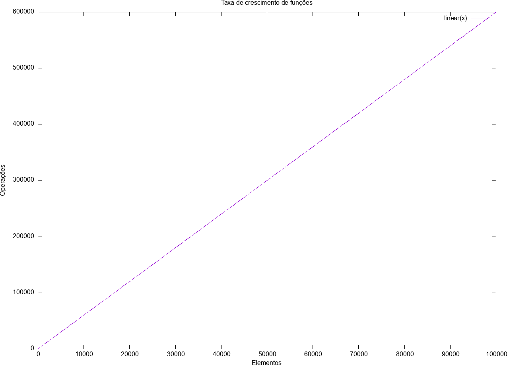

# Ordem de Funções - Análise de Algoritmos
<!-- - Notação O e similares
    - O que é a notação O e porque estudamos ordem de funções?
        - **Notação O**: É uma ferramenta usada para analise de algoritmos. Auxiliando a entender e comparar o tempo de execução (número de passos executados) de algoritmos em relação ao crescimento/tamanho/natureza do problema. É realizado uma abstração em relalção ao tipo de linguagem utilizada, hardware, software disponíveis e assumindo:
            * O tamnho da entrada como sendo n
            * Cada operação leva aproximadamente o mesmo tempo constante (adição, atribuição, chamda de funções, retorno de funções comparações...) 
        - **Ordem de Funções**: Também conhecida como análise assintótica. Nos ajudam a entender e analisar o desempenho dos algoritmos. -->

- Algoritmos
    Segundo Crmen et. al. (2002), um algoritmo é um procedimento computacional bem definido que toma um conjunto de valores como entrada e produz algum conjunto de valores como saída.
    Sendo assim, precisamos entender quais características são importantes em um algoritmo. De forma superficial e abstrata, podemos resumir que as características mais relevantes para um algoritmo são:
    - Perfomace.
    - Simplicidade: Quanto mais simples, mais fácil o entedndimento e menor a chance de erros.
    - Corretude: Segundo Cormen, um algoritmo é correto se, para toda **instância** de entrada **válida**, ele terminar com a saída correta.

    Desejamos que um algotirmo seja correto, no entanto isso não pode ser a qualquer custo, devemos levar em consideração a eficiência do algoritmo.

-------------------

- Custo de Algoritmos
O custo computacional de um algoritmos, pode ser avalido por duas pespectivas: tempo de execução e espaço ocupado na memória.
Para a aplicação de análise de algoritmos, analisar o espaço ocupado torna a análise menos genérica (uma lista de caracters requer menos espaço na memória do que um conjunto de imagens). Sendo assim, para melhor compreensão de análise de algoritmos, iremos abstrair alguns conceitos e iremos assumir que a eficiência de um algoritmo está relacionado ao tempo de execução em função do tamanho da entrada a ser processada.

Custo de utilização:
- O tempo de execução de um programa pode ser influenciado por diversos fatores, como: SO, linguagem, compilador, hardware, tipo do dado de entrada...
- Sendo assim, iremos assumir:
    - O tamnho da entrada como sendo n
    - Cada operação leva aproximadamente o mesmo tempo constante $c$  (adição, atribuição, chamda de funções, retorno de funções comparações...) 

-----------------------
- Análise experimental:

Dado um problema, devemos ser capazes de mapea-lo em uma classe de algoritmos e encontrar qual deles apresentam a melhor eficiência computacional.

Por exemplo, dado um vetor de tamanho n, desejamos encontrar o valor valor:

```
int arrayMax (int input1[], int n)
{
    currentMax = input1[0];
    for (i=1; i<n; i++){
            if (input1[i] > currentMax)
                currentMax = input1[i];
    }

    return currentMax;
}
```
Ao analisarmos o número de operações primitivas realizadas no código, chegamos ao seguinte número de passos: 
Vamos considerar que todas as operações levam o mesmo tempo para serem executadas, assim contando apenas o número de passos.

```
1 atribuição e 1 indexação (currentMax = input1[0])
1 atribuição (i=1)
repete n-1 vezes [1 teste (i<n), 1 indexação (input1[i]), 1 teste (>), 
                  1 atribuição (currentMax = ...), 1 indexação (input1[i]), 1 incremento (i++)]
1 teste (i<n)
1 retorno

```
Simplificando número de operações, chegamos a função de eficiência do algoritmo analisado:
```
5 + (n-1)6 = 6n-1
```
Podemos então perceber como a função de eficiência cresce de acordo com o tamanho da entrada:





    
    
----------------------------

**OBS: Instância**: Uma instância pode ser compreendida  como sendo uma entrada única do problema a ser resolvido. Por exemplo, considere um algoritmo capaz de lidar com diferentes tipos de entradas, por exemplo, uma lista de letras e uma lista de imagens. Cada uma dessas entradas seria considera uma instância sepadada do problema
    <!-- (não vamos nos preocupar com o tratamento de excessões no que diz respeito ) -->
 <!-- - www.comp.ita.br/~alonso/ensino.html -->

## Bibliografia 

 - Cormen: Introduction to algorithm
 - Knuth: The art of computer programing
 - Sedgewick: Algorithms
 - Drozdek: Estrutura de dados e algoritmos em C++
 - Ziviani
 - Aulas de P.Feofiloff: ime.usp
 - Simulação de algoritmos

## Ordem de funções - Notação O (Big-Oh) e similares

Análise da eficiência dos algoritmos
Avaliar instâncias e o tempo de execução. O que são instâncias? Ou seja, variar instancias e tamanhos
- como lidar com a plotagem de instancias? 
    - preciso de algum tipo de ferramenta para avaliar dos dados

- Tempo de execução
 - Qual o ponto de partida/estudos? 
    - O pior caso é o mais importante, pois é crucial para a qualidade das aplicações
    - É possivel que o pior caso (possui duas inconveniências: excessão e comportamento assintótico que pode estar tratando casos irreais)seja um excessão (quick sort, em que a entrada está ordenada e/ou contantes). A parte desprezada N(0) de uma  
    - 

### Análise teórica de complexidade
- Levar em consideração entradas válidas

###Ope

### Variáveis indexadas
- Vetores, matrizes
- Ver calculo de posição incial do vetor*
- 


### Taxas de crescimento
Qual a taxa de crescimento me interessa mais?
Grafico log-log (o grau da função vira o coeficiente da reta)

###comportamento assintótico


### notação O (teto assintótico (n tende ao infinito)) 
    só funciona para complexidades distantas

- É uma notação que avalia o algorítmo em regime permanente
- ver calculo para determinar n(0) ou seja, o ponto de regime permanente
complexidade de tempo (existe de espaço também)- agrupa a taxa de crescimento do ponto de vista assintótico

Ao estudar, veja exemplos de cada funções, tenha familiaridade com o tema


## Execício
- Ver o básico de paralelismo


